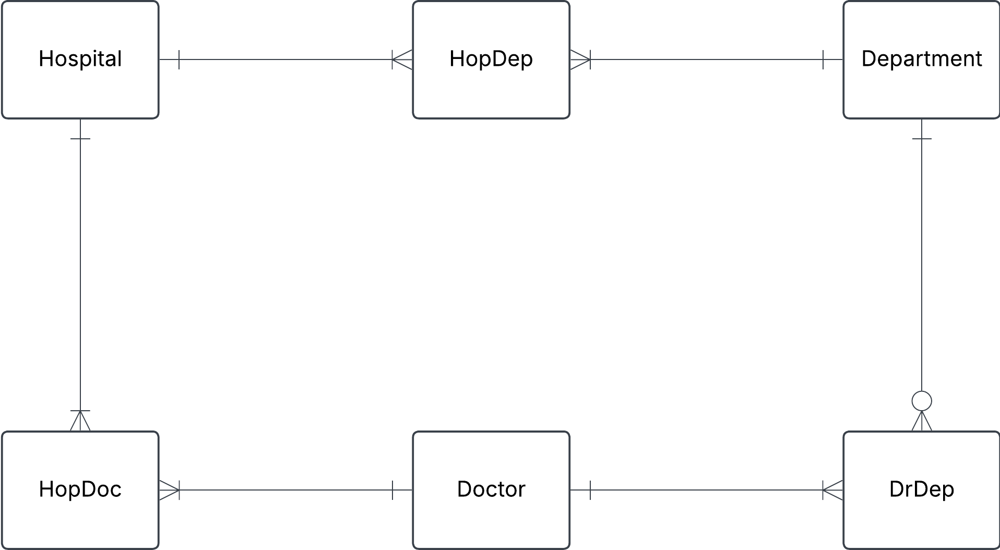
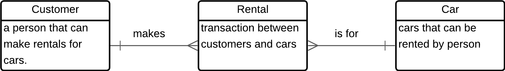

# Exercise 0

## 1. Hospital task

You have this json data, convert it into three tables: Hospital, Department and Doctor. Fill these tables with data. Do this manually and not programmatically.

```json
{
  "hospital": "Sjukhusstock",
  "address": "Drottninggatan 3, Stockholm",
  "departments": [
    {
      "name": "Kardiologi",
      "doctors": [
        { "id": 1, "name": "Dr. Abra Abrahamson" },
        { "id": 2, "name": "Dr. Erika Eriksson" }
      ]
    },
    {
      "name": "Neurologi",
      "doctors": [{ "id": 3, "name": "Dr. Sven Svensson" }]
    }
  ]
}
```

### Solution

Approach

- identify entites
- identify relationships
- create conceptual EDR
- create tables

**Initial naive conceptual ERD**

 

**Initial tables**

Hospital

| hospital_id | name         | adress           |
| ----------- | ------------ | ---------------- |
| 1           | Sjukhusstock | Drottninggatan 3 |

Department

| department_id | name       |
| ------------- | ---------- |
| 1             | Kardiologi |
| 2             | Neurologi  |

Doctor

| doctor_id | name       |
| --------- | ---------- |
| 1         | Dr. Lecter |
| 2         | Dr. Dre    |
| 3         | Dr. House  |

Refined with bridge tables to reflect many-to-many relationships



<br>
HospitalDepartment

| hopDepId | hospitalId | departmentId |
| -------- | ---------- | ------------ |
| 1        | 1          | 1            |
| 2        | 1          | 2            |

HospitalDoctor

| hopDocId | hospitalId | doctorId |
| -------- | ---------- | -------- |
| 1        | 1          | 1        |
| 2        | 1          | 2        |
| 3        | 1          | 3        |

DoctorDepartment

| docDepId | doctorId | departmentId |
| -------- | -------- | ------------ |
| 1        | 1        | 1            |
| 2        | 1        | 2            |
| 3        | 2        | 3            |


---

## 2. Library Bookly
A library called Bookly keeps track of books and members who borrow them. Each book has a title, author, and ISBN number. Each member has a membership ID, name, and contact information. A member can borrow multiple books, but each book can be borrowed by only one member at a time.

a) Identify the entities and attributes for each entity.

**book**

- ISBN
- title
- author


> [!NOTE]
> ISBN is a unique number for a book, which could be used as `primary key`, this will make it into a `natural key`


**member**
- memberId
- firstName
- lastName
- phone
- address
- email

**loan**
- loanId
- ISBN
- memberId
- returnDate
- loanDate

b) Determine the relationship between member and books.

- A Member can have 0, 1 or several Loans
- A Loan can be made by 1 and only 1 Member
- A Loan is linked to 1 and only 1 Book
- A Book can be in 0, 1 or several Loans over time

c) Draw a conceptual ERD using crow foots notation.

Initial conceptual ERD


<br>

Replaced many-to-many with a bridge table


---

## 3. Conceptual ERD to words

This is an ERD conceptual diagram that a database designer and the business stakeholders agreed upon in a car rental company called Carent.


<br>
a) Describe the entities in this conceptual ERD.

- Customer is a person that can make rentals for cars.
- Car is the cars that can be rented by person
- Rental (composite entity) is a transaction between customers and cars


alternative to put in descriptions into the entities directly in conceptual ERD

b) Write out the relationship labels.



<br>
c) Describe the relationships between the entities

- Customer to rental (one-to-many)
- Rental to Customer (many-to-one)
- Rental to Car (many-to-one)
- Car to Rental (one-to-many)

d) Define the relationship statement for example: "A Customer can have one or more Rentals".

- Each Customer makes one or more Rentals over time
- Each Rental is connected to one Customer
- Each Rental is for one Car
- Each Car can be in several Rentals  

## 4. Online

## 5. University management system

## 6. Onshop

## 7. Theoretical questions

## Glossary
